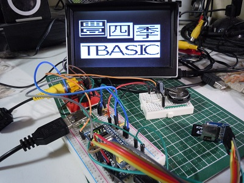
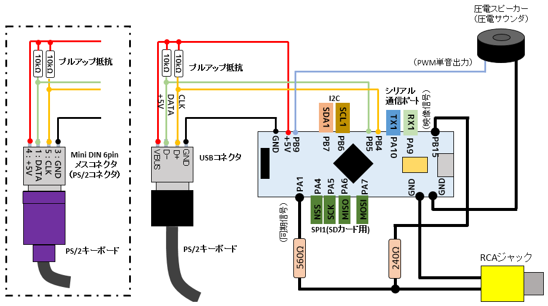
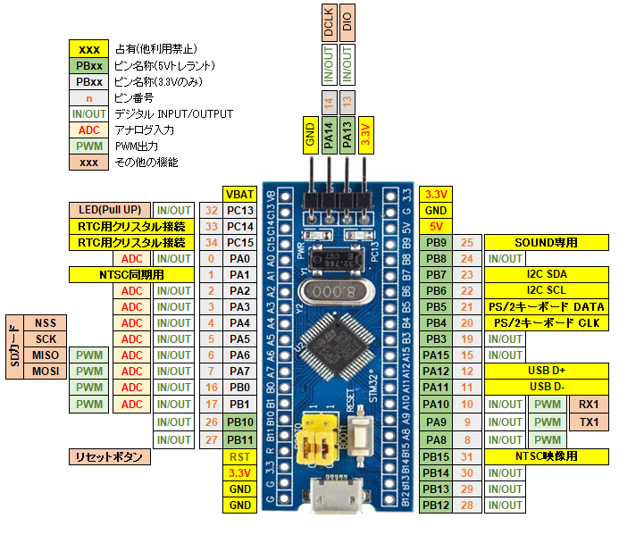
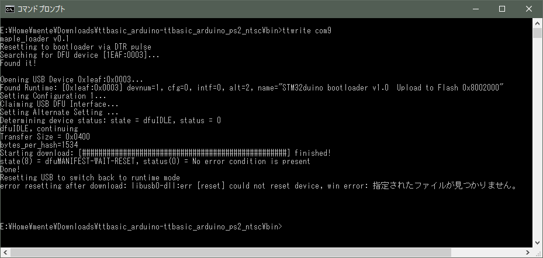

## 豊四季タイニーBASIC for Arduino STM32 V0.83(2017/06/14)
(NEW) SDカード対応
※公開版整備中..... ダウンロードはちょっと待ってください^^  



NTSC・PS/2キーボード対応ブランチ版  
(ドキュメント修正中）  

本プログラムは、下記オリジナル版をArduino STM32向けに移植・機能版です.  
STM32F103C8T6搭載のBlue Pillボード、Black Pillボードでの動作を確認しています.  
※機能の大幅追加のため、Arduino MEGEは非対応となりました.  
※NTSCビデオ出力対応のため、ターミナル画面制御は非対応にしました(2017/04/13)  

- オリジナル版配布サイト  
 https://github.com/vintagechips/ttbasic_arduino  
 関連情報 [電脳伝説 Vintagechips - 豊四季タイニーBASIC確定版](https://vintagechips.wordpress.com/2015/12/06/%E8%B1%8A%E5%9B%9B%E5%AD%A3%E3%82%BF%E3%82%A4%E3%83%8B%E3%83%BCbasic%E7%A2%BA%E5%AE%9A%E7%89%88/)

**「豊四季タイニーBASIC」**の著作権は開発者**のTetsuya Suzuki**氏にあります.  
プログラム利用については、オリジナル版の著作権者の配布条件に従うものとします.  
著作権者の同意なしに経済的な利益を得てはいけません.  
この条件のもとで、利用、複写、改編、再配布を認めます.  

システム構成  
  

Blue Pillボード結線図  
  

SDカードモジュール接続  
  

RTC用バックアップ電池  
  

ピン利用構成  
  

- **利用可能市販パーツ**  
  - PS/2キーボード用コネクタ  
  aitendo PS/2モジュール [ML-PS2-4P] http://www.aitendo.com/product/11377  
  秋月電子 USBコネクタDIP化キット(Aメス) http://akizukidenshi.com/catalog/g/gK-07429/  
  - NTSC用 RCAコネクタ  
  aitendo TVOUTモジュールキット [K-TVOUT2R] http://www.aitendo.com/product/11740  
  aitendo RCAモジュールキット [brebo.jam.rca] http://www.aitendo.com/product/12125  
  秋月電子 RCAジャックDIP化キット(黄) http://akizukidenshi.com/catalog/g/gK-06522/  
  ※aitendo製品は付属抵抗を使うと若干出力電圧が上がりますが、許容範囲です。そのまま利用できます。  


**オリジナル版からの拡張機能**
 NTSCビデオ出力対応  
 PS/2キーボード対応  
 フルスリーンテキストエディタ編集対応  
 GPIO、I2C、シリアル通信対応  
 コマンド・関数の追加

詳細は[リファレンスマニュアル(nmanual.pdf)](https://github.com/Tamakichi/ttbasic_arduino/raw/ttbasic_arduino_ps2_ntsc/manual.pdf)に  
記載しています(ただし追加・修正中)  

## ファームウェア書込み手順(Windows 10の場合)  
V0.83からはバイナリー形式のファームウェアを添付しました.  
この書き込み方法について説明します.  
(事前準備)  
「豊四季Tiny BASIC for Arduino STM32」ファームウェアの書込みには、  
事前にArduino STM32環境を導入し、付随するUSBドラーバーをインストール等が必要です.  
また、Blue Pillボード(または他のSTM32F103C8T6ボード)ブートローダを書きこんでおく必要があります.  
このあたりの設定は、DEKOさんがまとめました記事が参考になると思います(素晴らしいまとめの公開に感謝!!)  
DEKOのアヤシいお部屋-「STM32F103C8T6」 - http://ht-deko.com/arduino/stm32f103c8t6.html  

1)ブロジェクト一式のダウンロード  
プロジェクト一式をダウンロードし、解凍した中のフォルダ**bin**内のフォルダを開いて下さい.  
  

2)コマンドプロンプト上でコマンド実行  
上記のフォルダ**bin**に移動し、次のコマンドを実行します.  
>ttwrite COM9  
これで書き込みを行います.  

COM9はBlue PillボードのUSB-シリアルのポートを指定します.  
各自の環境に合わせて指定して下さい.  
コマンドプロンプト上で、MODE[ENter]でも調べられます.  

  


## スケッチの書込み手順
Arduino IDE経由で書き込みを行う場合は、「豊四季Tiny BASIC for Arduino STM32」  
スケッチ本体の他に、ライブラリが必要になります.  

1)ライブラリの配置  
プロジェクト一式をダウンロードし、解凍した中の、フォルダ**libraries**内のフォルダを  
各自のArduino環境のライブラリ配置ディレクトリ**libraries**に配置して下さい.  
  

Arduino STM32環境に依存するライブラリのため、下記のディレクトリの配置でも良いです.  
(古いバージョンのArduino IDEと共存利用している環境では競合等回避のためここへの配置を推奨）  
\hardware\Arduino_STM32\STM32F1\libraries  

添付ライブラリの個別利用・入手は下記のリンクを参照して下さい.  

**ライブラリ一覧**  
 - Arduino STM32 内部フラッシュメモリ書き込みライブラリ  
   https://github.com/Tamakichi/ArduinoSTM32_TFlash  
 - Arduino STM32 NTSCビデオ出力ラブラリ(最新版)  
   https://github.com/Tamakichi/ArduinoSTM32_TNTSC  
 - Arduino STM32 TTVoutライブラリ(最新版)  
   https://github.com/Tamakichi/ArduinoSTM32_TVout  
 - TTVoutfont TVout用フォント  
   https://github.com/Tamakichi/TTVoutfont  
 - Arduino STM32用 PS/2 キーボードライブラリ(最新版)  
   https://github.com/Tamakichi/ArduinoSTM32_PS2Keyboard  
 - Arduino SDライブラリ(修正版)  
   https://github.com/Tamakichi/SD  
- Arduino用Bitmap画像ロードライブラリ    
   https://github.com/Tamakichi/Arduino-SD-Bitmap      
- ビットマップ操作ライブラリ V 0.1  
   https://github.com/Tamakichi/libBitmap       

2)スケッチ本体のフォルダ**ttbasic**を各自のスケッチ配置フォルダの配置  
3)Arduino IDE(Arduino STM32環境インストール済み)の起動  
4)ボート選択  
5)コンパイル&スケッチ書込み  

V0.82からの変更点  
  

## サンプルプログラム
### ボード上のLEDの点滅  
```
10 P=PC13
20 GPIO P,OUTPUT
30 OUT P,HIGH
40 FOR I=1 TO 10
50 OUT P,LOW
60 WAIT 300
70 OUT P,HIGH
80 WAIT 300
90 NEXT I
```

### アナログ値表示
```
10 CLS
20 GPIO PB01,ANALOG
30 A=ANA(PB01)
40 LOCATE 5,5: ? A; "     "
50 GOTO 30
```
### 配列の連続設定
```
10 @(1)=1,2,3,4,5,6,7,8
20 FOR I=1 TO 8
30 ? "@(";I;")=";@(I)
40 NEXT I
```

### シフト演算
```
10 A=1
20 FOR I=0 TO 16
30 ? HEX$(A<<I,4)
40 NEXT I
```

### ラベルの利用
```
100 GOSUB "SUB01"
110 GOSUB "SUB02"
120 N=0
130 "LOOP"
140 PRINT "N=";N
150 N=N+1:IF N<5 GOTO "LOOP"
160 END
170 "SUB01"
180 PRINT "SUB01"
190 RETURN
200 "SUB02"
210 PRINT "SUB02"
220 RETURN
```

## 以降はオリジナルのドキュメントです


TOYOSHIKI Tiny BASIC for Arduino

The code tested in Arduino Uno R3.<br>
Use UART terminal, or temporarily use Arduino IDE serial monitor.

Operation example

&gt; list<br>
10 FOR I=2 TO -2 STEP -1; GOSUB 100; NEXT I<br>
20 STOP<br>
100 REM Subroutine<br>
110 PRINT ABS(I); RETURN

OK<br>
&gt;run<br>
2<br>
1<br>
0<br>
1<br>
2

OK<br>
&gt;

The grammar is the same as<br>
PALO ALTO TinyBASIC by Li-Chen Wang<br>
Except 3 point to show below.

(1)The contracted form of the description is invalid.

(2)Force abort key<br>
PALO ALTO TinyBASIC -> [Ctrl]+[C]<br>
TOYOSHIKI TinyBASIC -> [ESC]<br>
NOTE: Probably, there is no input means in serial monitor.

(3)Other some beyond my expectations.

(C)2012 Tetsuya Suzuki<br>
GNU General Public License
